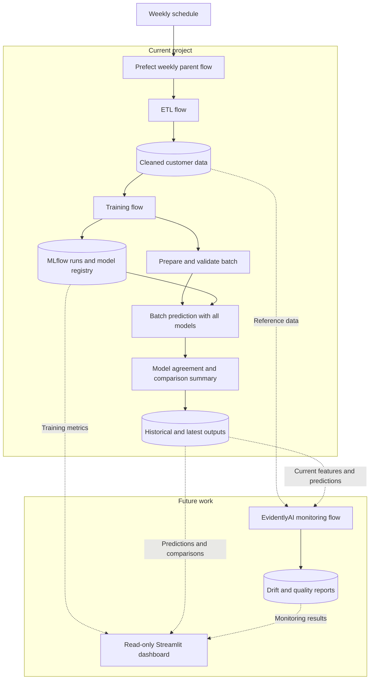

# Weekly Offline Churn Workflow Plan

## Status: partially implemented, deliberately closed

The project stops here. Items 1, 2, 3, and 9 below are **built**, plus the
multi-model comparison report (the analytical half of item 7). Items 4, 5, 6, and
8 were **evaluated and skipped** — they rewrite working code without improving
the project as a student deliverable.

| Item | Status | Notes |
|------|--------|-------|
| 1 — parent flow | ✅ Built | `scripts/run_weekly.py`, ~35 lines. Sequential calls give the "failure stops downstream" requirement for free. |
| 2 — deployment + schedule | ✅ Built | `flow.serve(schedule=CronSchedule(...), limit=1)`. Simpler than planned: no work pool or worker needed. |
| 3 — ETL timeout | ✅ Built | `timeout_seconds` 30 → 900 in `scripts/run_etl.py`. Was a real latent bug — a cold Kaggle download can't finish in 30s. |
| 4 — refresh generated batch | ✅ Built | One mtime check in `prepare_batch_input`: a generated batch older than `fallback_source` is rebuilt, since each ETL run re-splits the holdout and the stale file would score training rows. A real extract is still protected — by `fallback_source: null`, which skips the task. |
| 5 — drop `@champion`, `latest` aliases | ⏭️ Skipped | Wide refactor of `batch.py` + config + tests. Selecting the best classifier by `roc_auc` is defensible ML, and item 7's `consensus_prediction` would have re-introduced an authoritative answer by majority vote — a weaker decision rule than the one it replaced. |
| 6 — require all three classifiers | ⏭️ Skipped | Turns working graceful degradation into a hard failure for no gain. |
| 7 — agreement analysis | ◐ Built as a report | Aggregated into `model_comparison_*.csv` (per-model stats + agreement) instead of 8 derived columns on every row. Same analytical question, one small file, no row-level bloat. Per-customer columns remain easy to add in `generate_predictions`. |
| 8 — batch manifest | ⏭️ Skipped | Duplicates lineage the predictions parquet already carries per row (`batch_id`, `model_uri`, `model_version`, `prediction_timestamp`). |
| 9 — documentation | ✅ Built | `README.md`, `project.md`, `CLAUDE.md`. |

The original plan follows unchanged, for the record.

## Project boundary

This is a valid student project when presented as a **scheduled offline
analytical ML workflow**, rather than a production prediction service.

The implemented project will finish after batch prediction and multi-model
comparison. EvidentlyAI, Streamlit, automated retraining triggers, alerts, an
API, and online model serving will remain documented future work.

Because the Kaggle dataset is static, the weekly schedule demonstrates Prefect
orchestration. It should not be presented as evidence that weekly retraining
improves the models.

## Workflow

Streamlit will read saved outputs rather than trigger workflows. EvidentlyAI
will run after prediction and compare each current batch against the reference
training data.

## Current-project changes

1. Add one `weekly_pipeline` parent flow that calls these stages sequentially:

   1. ETL
   2. model training
   3. batch preparation and validation
   4. batch prediction
   5. multi-model comparison

   A failed stage must prevent all downstream stages from running.

2. Deploy only the parent flow:

   - deployment name: `weekly-churn-analysis`
   - work pool: `local-process`
   - schedule: Monday at 09:00
   - timezone: `Europe/Belgrade`
   - cron: `0 9 * * 1`
   - concurrency limit: `1`

   The local Prefect server and process worker must be running when a scheduled
   execution is due.

3. Increase the ETL flow's 30-second timeout to 15 minutes.

4. Refresh the automatically generated held-out batch during each scheduled
   demonstration. Do not overwrite a batch supplied manually from an external
   source.

5. Treat the models equally:

   - register logistic regression, random forest, XGBoost, and KMeans under
     separate names;
   - give each registered model a `latest` alias;
   - remove the global `telco-churn-model@champion`;
   - do not select an authoritative or best classifier.

6. Require all three classifiers for a valid comparison. Save each model's:

   - churn probability;
   - predicted class;
   - risk group.

   Keep the KMeans segment as a separate analytical column.

7. Add customer-level comparison fields:

   - `models_predicting_churn`
   - `mean_churn_probability`
   - `minimum_churn_probability`
   - `maximum_churn_probability`
   - `probability_range`
   - `agreement_rate`
   - `consensus_prediction`
   - `agreement_category`

   Agreement categories will be `full_churn_agreement`,
   `full_non_churn_agreement`, and `partial_agreement`.

8. Persist:

   - timestamped prediction history;
   - fixed-name latest predictions;
   - timestamped and latest comparison summaries;
   - a batch manifest containing the batch ID, timestamp, data hash, row count,
     and URI/version of every model.

9. Update the project documentation so EvidentlyAI and Streamlit are clearly
   identified as future work.

## Verification

- Test that the parent flow executes stages in the required order.
- Test that a failure prevents downstream execution.
- Test generated-batch refresh and preservation of external batch files.
- Test per-model predictions, decision thresholds, risk boundaries, agreement
  calculations, consensus, and model lineage.
- Test failure when any required classifier is unavailable.
- Run the complete existing and new test suite.
- Trigger the deployment manually and confirm:

  - Prefect displays the parent flow and its ordered nested flows;
  - MLflow contains four completed model runs without a global winner;
  - every classifier scores the same held-out batch;
  - historical/latest predictions, comparison summaries, and the batch manifest
    are produced;
  - overlapping deployment runs are prevented.

## Final academic framing

> A Prefect-orchestrated offline machine-learning workflow for customer-churn
> analysis. The system performs ETL, trains and tracks multiple models in
> MLflow, generates batch predictions from every model, and analyzes model
> agreement without selecting a production winner. Monitoring with EvidentlyAI
> and interactive presentation with Streamlit are proposed as future work.
